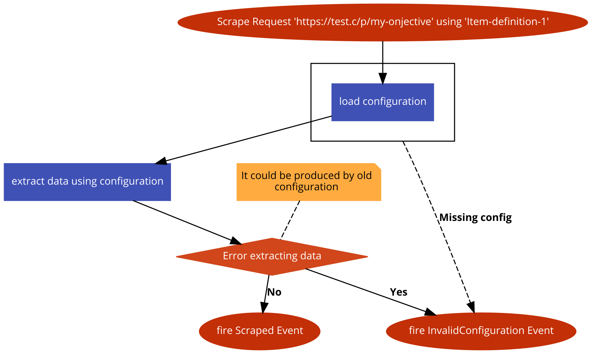
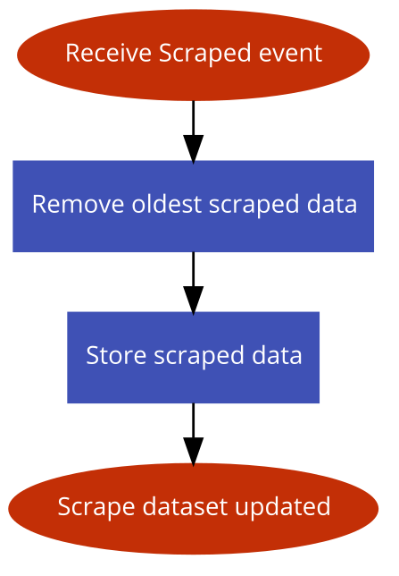
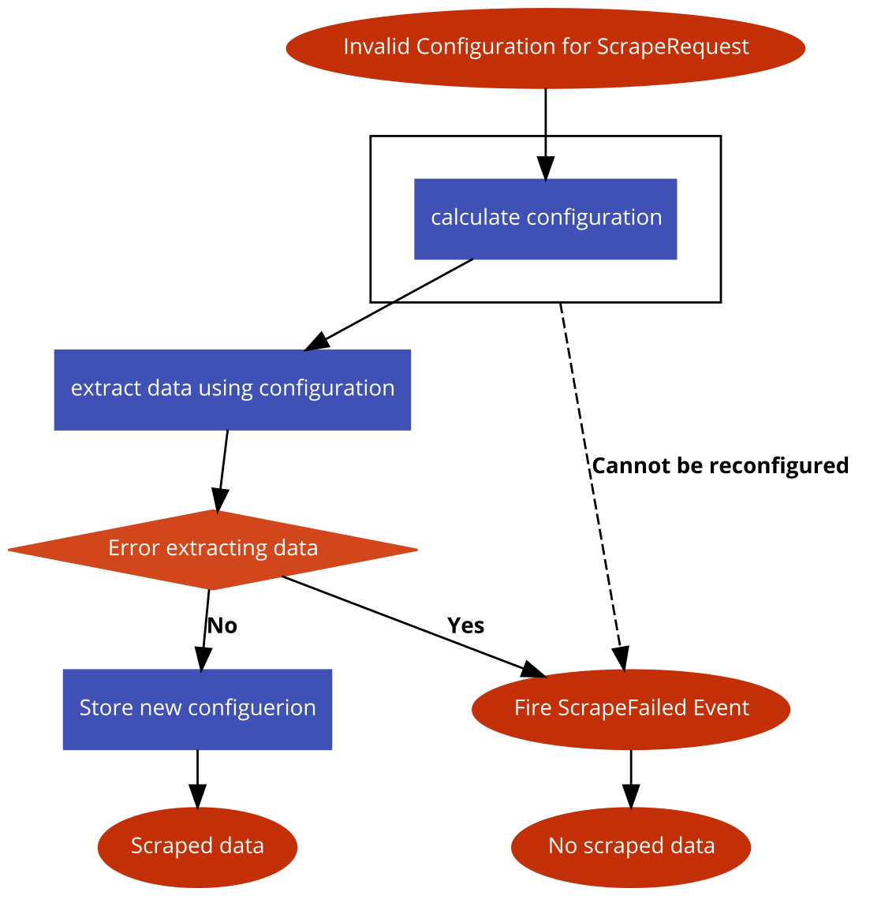

# Laravel Intelligent Scraper

[](https://github.com/softonic/laravel-intelligent-scraper/releases)
[](LICENSE.md)
[](https://travis-ci.org/softonic/laravel-intelligent-scraper)
[](https://scrutinizer-ci.com/g/softonic/laravel-intelligent-scraper/code-structure)
[](https://scrutinizer-ci.com/g/softonic/laravel-intelligent-scraper)
[](https://packagist.org/packages/softonic/laravel-intelligent-scraper)
[](http://isitmaintained.com/project/softonic/laravel-intelligent-scraper "Average time to resolve an issue")
[](http://isitmaintained.com/project/softonic/laravel-intelligent-scraper "Percentage of issues still open")


This packages offers a scraping solution that doesn't require to know the web HTML structure and it is autoconfigured
when some change is detected in the HTML structure. This allows you to continue scraping without manual intervention
during a long time.

## Installation

To install, use composer:

```bash
composer require softonic/laravel-intelligent-scraper
```

To publish the scraper config, you can use
```bash
php artisan vendor:publish --provider="Softonic\LaravelIntelligentScraper\ScraperProvider" --tag=config
```

The migrations for database are registered in the service provider, so you can execute the migrate command to create the needed tables.
```bash
php artisan migrate
```

### Dependencies

This package depends on [goutte](https://packagist.org/packages/fabpot/goutte) that depends on [guzzle](https://packagist.org/packages/guzzle/guzzle), so you can customize the client to
your requisites. The only requirement for this package is that you must include the `http_error` midleware in the
handle stack.

Example:
```php
<?php

use GuzzleHttp\Handler\CurlHandler;
use GuzzleHttp\HandlerStack;
use GuzzleHttp\Middleware;
use Goutte\Client as GoutteClient;
use App\MyMiddleware;

$client = new GoutteClient();
$stack = new HandlerStack();

$stack->setHandler(new CurlHandler());
$stack->push(MyMiddleware::getHandler(), 'my_middleware'); // Your custom middleware
$stack->push(Middleware::httpErrors(), 'http_errors'); // Required middleware for the package

$guzzleClient = new GuzzleClient(['handler' => $stack]);
$client->setClient($guzzleClient);
```

The default stack already has the http_errors middleware, so you only need to do this if you are not using the default stack.

## Configuration

There are two different options for the initial setup. The package can be 
[configured using datasets](#configuration-based-in-dataset) or 
[configured using Xpath](#configuration-based-in-xpath). Both ways produces the same result but 
depending on your Xpath knowledge you could prefer one or other. We recommend to use the
[configured using Xpath](#configuration-based-in-xpath) approach.

### Configuration based in dataset

The first step is to know which data do you want to obtain from a page, so you must go to the page and choose all
the texts, images, metas, etc... that do you want to scrap and label them, so you can tell the scraper what do you want.

An example from microsoft store could be:
```php
<?php
use Softonic\LaravelIntelligentScraper\Scraper\Models\ScrapedDataset;

ScrapedDataset::create([
    'url'  => 'https://test.c/p/my-objective',
    'type' => 'Item-definition-1',
    'data' => [
        'title'     => 'My title',
        'body'      => 'This is the body content I want to get',
        'images'    => [
            'https://test.c/images/1.jpg',
            'https://test.c/images/2.jpg',
            'https://test.c/images/3.jpg',
        ],
    ],
]);
```

In this example we can see that we want different fields that we labeled arbitrarily. Some of theme have multiple
values, so we can scrap lists of items from pages.

With this single dataset we will be able to train our scraper and be able to scrap any page with the same structure.
Due to the pages usually have different structures depending on different variables, you should add different datasets
trying to cover maximum page variations possible. The scraper WILL NOT BE ABLE to scrap page variations not incorporated
in the dataset.

Once we did the job, all is ready to work. You should not care about updates always you have enough data in the dataset
to cover all the new modifications on the page, so the scraper will recalculate the modifications on the fly. You can 
check [how it works](how-it-works.md) to know much about the internals.

We will check more deeply how we can create a new dataset and what options are available in the next section.

#### Dataset creation

The dataset is composed by `url` and `data`. 
* The `url` part is simple, you just need to indicate the url from where you obtained the data.
* The `type` part gives a item name to the current dataset. This allows you to define multiple types.
* The `variant` identifies the page variant. The identifier is a sha1 hash build based in the xpath used to get the data.
* The `data` part is where you indicate what data and assign the label that you want to get. 
The data could be a list of items or a single item.

A basic example could be:
```php
<?php
use Softonic\LaravelIntelligentScraper\Scraper\Models\ScrapedDataset;

ScrapedDataset::create([
    'url'     => 'https://test.c/p/my-objective',
    'type'    => 'Item-definition-1',
    'variant' => '8ed10778a83f1266e7ffed90205f7fb61ddcdf78',
    'data'    => [
        'title'     => 'My title',
        'body'      => 'This is the body content I want to get',
        'images'    => [
            'https://test.c/images/1.jpg',
            'https://test.c/images/2.jpg',
            'https://test.c/images/3.jpg',
        ],
    ],
]);
```

In this dataset we want that the text `My title` to be labeled as title and we also have a list of images that we want 
to be labeled as images. With this we have the flexibility to pick items one by one or in lists.

Sometimes we want to label some text that it is not clean in the HTML because it could include invisible characters like
`\r\n`. To avoid to deal with that, the dataset allows you to add regular expressions.

Example with `body` field as regexp:

```php
<?php
use Softonic\LaravelIntelligentScraper\Scraper\Models\ScrapedDataset;

ScrapedDataset::create([
    'url'  => 'https://test.c/p/my-objective',
    'type' => 'Item-definition-1',
    'variant' => '8ed10778a83f1266e7ffed90205f7fb61ddcdf78',
    'data' => [
        'title'     => 'My title',
        'body'      => regexp('/^Body starts here, but it is do long that.*$/si'),
        'images'    => [
            'https://test.c/images/1.jpg',
            'https://test.c/images/2.jpg',
            'https://test.c/images/3.jpg',
        ],
    ],
]);
```

With this change we will ensure that we detect the `body` even if it has hidden characters. 

**IMPORTANT** The scraper tries to find the text in all the tags including children, so if you define a regular
expression without limit, like for example `/.*Body starts.*/` you will find the text in `<html>` element due to that 
text is inside some child element of `<html>`. So define regexp carefully.

### Configuration based in Xpath

After you collected all the Xpath from the HTML, you just need to create the configuration models. They looks like:
```php
<?php
use Softonic\LaravelIntelligentScraper\Scraper\Models\Configuration;

Configuration::create([
    'name' => 'title',
    'type' => 'Item-definition-1',
    'xpaths' => '//*[@id=title]',
]);

Configuration::create([
    'name' => 'category',
    'type' => 'Item-definition-1',
    'xpaths' => ['//*[@id=cat]', '//*[@id=long-cat]'],
]);
```

In the definition, you should give a name to the field to be scraped and identify it as a type. The xpaths field could
contain a string or an array of strings. This is because the HTML can contain different variations depending on the
specific page, you you can write a list of Xpath that will be checked in order giving the first result found.

## Usage

After configure the scraper, you will be able to request an specific scrape using the `scrape` helper
```php
<?php 

scrape('https://test.c/p/my-objective', 'Item-definition-1');
```

There is an optional parameter called `context` that allows you to set a context to the scrapeRequest so you will
be able to access that context in your listener. This is useful if you need some additional data (out of the scraped
data) to work in your listener.

```php
<?php

scrape('https://test.c/p/my-objective', 'Item-definition-1', ['id' => 'my-objective']);
```

The scrape will produce a `\Softonic\LaravelIntelligentScraper\Scraper\Events\Scraped` event if all worked as expected.
So attach a listener to that event to receive the data.

```php
$event->scrapeRequest->url;  // Url scraped
$event->scrapeRequest->type; // Request type
$event->scrapeRequest->context; // Context
$event->data; // Contains all the data in a [ 'fieldName' => 'value' ] format.
$event->variant; // Contains the page variation sha1 hash.
```

All the output fields are arrays that can contain one or more results.

If the scrape fails a `\Softonic\LaravelIntelligentScraper\Scraper\Events\ScrapeFailed` event is fired with the
scrape request information.
```php
$event->scrapeRequest->url;  // Url scraped
$event->scrapeRequest->type; // Request type
$event->scrapeRequest->context; // Context
```

To attach the listener, you can use the Laravel listener configuration like:
```php
// providers/EventServiceProvider
    protected $listen = [
        Scraped::class => [
            MyListener::class,
        ],
        ScrapeFailed::class => [
            MyListenerFirFailedScrapes::class,
        ],
    ];
```

But the scrapes from all types will go to that listeners. To simplify the listeners and just listen scrapes from a
single type, there is a `listeners` configuration available at scraper.php, so you can configure the listeners
with greater granularity.
```php
    // config/scrapper.php
    'listeners' => [
        'scraped' => [
            'my-type-1' => ListenerForTypeOne::class,
            'my-type-2' => ListenerForTypeTwo::class,
        ],
        'scrape-failed' => [
            'my-type-1' => ListenerFailedForTypeOne::class,
        ],
    ];
```

## Advanced usage

There is another event named `ConfigurationScraped` that is triggered when a scrape is done automatically in the
reconfiguration step. It is exactly the same than `Scraped` event. It is named differently because usually it is not
interesting to use it apart from internally to update the dataset.

`ConfigurationScraped` can be used to do updates or to know internals about the configuration process.

### Queue workers

You need to workers, one for the default queue and another for the `configure` queue. The `configure` worker
should be a single worker to avoid parallel configurations.

```bash
php artisan queue:work # As many as you want
php artisan queue:work --queue=configure # Just one
```

## Testing

`softonic/laravel-intelligent-scraper` has a [PHPUnit](https://phpunit.de) test suite and a coding style compliance test suite using [PHP CS Fixer](http://cs.sensiolabs.org/).

To run the tests, run the following command from the project folder.

``` bash
$ docker-compose run test
```

To run interactively using [PsySH](http://psysh.org/):
``` bash
$ docker-compose run psysh
```

## How it works?

The scraper is auto configurable, but needs an initial dataset or add a configuration. 
The dataset tells the configurator which data do you want and how to label it.

There are three services that have unique responsibilities and are connected using the event system.

### Scrape

It is fired when the system receive a `\Softonic\LaravelIntelligentScraper\Scraper\Events\ScrapeRequest` event. It
can be done using our `scrape($url, $type)` helper function.



```
# Powered by https://code2flow.com/app
Scrape Request 'https://test.c/p/my-onjective' using 'Item-definition-1';
try {
  load configuration;
}
catch(Missing config) {
  goto fail;
}

extract data using configuration;
// It could be produced by old configuration
if(Error extracting data) {
  goto fail
}

fire Scraped Event;
return;

fail:
fire InvalidConfiguration Event;
```


### Update dataset

To be reconfigurable and conserve the dataset freshness the scraper store the latest data scraped automatically.



```
# Powered by https://code2flow.com/app
Receive Scraped event;
Remove oldest scraped data;
Store scraped data;
Scrape dataset updated;
```

### Configure Scraper

If a InvalidConfiguration event is fired, the system tries to calculate a new configuration to get the information from
ScrapeRequest.



```
# Powered by https://code2flow.com/app
Invalid Configuration for ScrapeRequest;

try {
  calculate configuration;
}
catch(Cannot be reconfigured) {
  goto fail;
}

extract data using configuration;
if(Error extracting data) {
  goto fail;
}

Store new configuerion;
Scraped data;
return;
fail:
Fire ScrapeFailed Event;
No scraped data;
```

This process could produce two different events:
* Scraped: All worked as expected and the page was scraped
* ScrapeFailed: The scrape couldn't be done after recalculate config, so we need a manual configuration action to fix it.

## License

The Apache 2.0 license. Please see [LICENSE](LICENSE) for more information.

[PSR-2]: http://www.php-fig.org/psr/psr-2/
[PSR-4]: http://www.php-fig.org/psr/psr-4/
